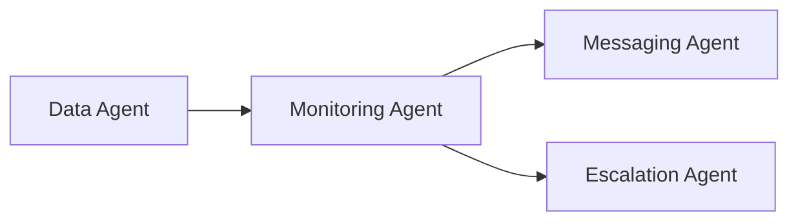

# 🟦 Monitoring Agent

### _Part of the 5-Agent Customer Engagement Automation System_

The **Monitoring Agent** is the decision-making brain of the system.  
It analyzes user inactivity, determines whether action is required, and routes users to the correct downstream agent (Messaging or Escalation).

This agent ensures that **no customer goes unnoticed** and that users receive the appropriate follow-up at the right time.

---

## 🚀 Purpose

The Monitoring Agent continuously evaluates user login behavior and decides the next step:

- Send a reminder notification?
- Offer help?
- Escalate to Customer Success?
- Or take no action?

It interprets the cleaned dataset from the **Data Agent** and converts it into **actionable instructions**.

---

## 🧠 Responsibilities

### **1. Receive Cleaned User Data**

The agent consumes standardized JSON data from the Data Agent, typically containing:

- `email`
- `client_id`
- `last_login`
- `days_inactive`
- `status`

**Example input:**

```json
{
  "email": "jane@example.com",
  "client_id": "A101",
  "last_login": "2025-01-12T07:20:00Z",
  "days_inactive": 7,
  "status": "at_risk"
}
```

### **2. Compute or Verify days_inactive**

Even though this is pre-computed, the Monitoring Agent:

Re-validates timestamps
Recomputes when necessary
Ensures timezone consistency

Formula:

```
days_inactive = NOW - last_login
```

### 3. Classify User Activity

The agent categorizes users based on inactivity thresholds:

| Days Inactive | Category |
| ------------- | -------- |
| 0–2           | Active   |
| 3–6           | Warning  |
| 7–13          | At-risk  |
| ≥ 14          | Escalate |

This classification is embedded into the output.

### 4. Decide the Next Action

| Days Inactive | Action                      | Routed To        |
| ------------- | --------------------------- | ---------------- |
| 3             | Friendly reminder           | Messaging Agent  |
| 7             | “Do you need help?” message | Messaging Agent  |
| 14            | CRM task + alert to CS team | Escalation Agent |
| < 3           | No action                   | None             |

### 5. Flag Users Requiring Attention

Flags generated include:

- `inactive_3_day`
- `inactive_7_day`
- `inactive_14_day`
- `no_action`

These flags help downstream agents process users efficiently.

### 6. Output Structured Instructions

The agent produces a standardized handoff payload:

```json
{
  "email": "john@example.com",
  "client_id": "C001",
  "days_inactive": 7,
  "status": "at_risk",
  "next_step": "send_help_message",
  "handoff_agent": "messaging_agent"
}
```

This ensures downstream agents know exactly what to do.

### 7. Route Users Using A2A Protocol

Based on the `handoff_agent` value, the Monitoring Agent sends the user to:

- **Messaging Agent** — for 3-day and 7-day inactivity
- **Escalation Agent** — for 14-day+ inactivity

This enforces clean modularity.

### 8. Logging & Observability

The Monitoring Agent records:

- Decisions made
- Flags assigned
- Which agent was notified
- Evaluation timestamp

This supports debugging, metrics, and system supervision.

## Workflow Summary



```text
Data Agent → Monitoring Agent → (Messaging Agent OR Escalation Agent)
```

Example Decision Output

```
JSON[
  {
    "email": "jane@example.com",
    "days_inactive": 3,
    "next_step": "send_friendly_reminder",
    "handoff_agent": "messaging_agent"
  },
  {
    "email": "mark@example.com",
    "days_inactive": 14,
    "next_step": "escalate_to_cs_team",
    "handoff_agent": "escalation_agent"
  }
]
```

## Role Within the System

The Monitoring Agent is **Agent #2** in the 5-agent architecture:

1. **Data Agent** – Fetch & clean data
2. **Monitoring Agent** – Decide next step ← **You are here**
3. **Messaging Agent** – Notify user
4. **Escalation Agent** – Alert Customer Success
5. **Supervisor Agent** – Oversee entire workflow

**It is the decision-maker that turns raw data into meaningful action.**
